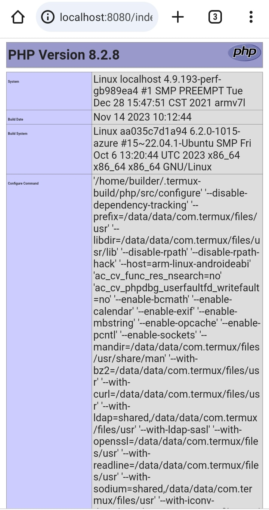

### What is TEMP Server:-
* This TEMP Server only for Android users or Termux users.
* If you didn't know what is termux than you read [here](https://en.m.wikipedia.org/wiki/Termux).
* T for [Termux](https://termux.dev) App.
* E for [Nginx](https://www.nginx.com) Web Server.
* M for [MariaDB](https://mariadb.com) Database Server.
* P for [PHP](https://www.php.net) Language.

### Termux Installation 
* If you install Termux app from Google [Play Store](https://play.google.com/store/apps/details?id=com.termux) maybe faced many problem in installation time.
* So you go to download termux App from [F-Droid](https://f-droid.org/repo/com.termux_118.apk) or [Github](https://github.com/termux/termux-app/releases/download/v0.118.0/termux-app_v0.118.0+github-debug_universal.apk) (Recommended).
* After install termux app than you follow this commands.

### TEMP Server Installation Commands:-
if not working 
```bash
./install.sh
```

1. Update your Termux Repositorie.

```bash
 pkg update
     or
 apt update
```
2. Update your Termux Packages.

```bash
pkg upgrade -y 
     or
apt upgrade -y
```
3. Install PHP Language and PHP-FPM (FastCGI Process Manager) for PHP.

```bash
pkg install php php-fpm -y
            or
apt install php php-fpm -y
```

4. Install MariaDB Database Server.

```bash
pkg install mariadb -y
         or
apt install mariadb -y
```

5. Install Nginx Web Server.

```bash
pkg install nginx -y
        or
apt install nginx -y
```

6. Install [PhpMyAdmin](https://www.phpmyadmin.net) for Mariadb/MySQL Client.

```bash
pkg install phpmyadmin -y
          or
apt install phpmyadmin -y
```
7. [Composer](https://getcomposer.org) is a [Dependency Manager](https://packagist.org) for PHP programming language so if you need composer than go to this command.

```bash
pkg install composer -y
         or
apt install composer -y # (Optional)

```
8. Install msmtp a lightweight SMTP (Simple Mail Transfer Protocol) client.

```bash
pkg install msmtp -y
       or 
apt install msmtp -y
```

### PHP and Nginx Configuration
* Set your project path
* `cd $PREFIX/etc/nginx` edit nginx.conf file `nano nginx.conf`.
```nginx
root /data/data/com.termux/files/usr/share/nginx/html;  #Default Set
# root /sdcard/your_project_path
index index.php index.html index.htm; # Set index
```
* Configuration PHP Script and PHP-FPM.

```nginx
location ~ \.php$ {
    fastcgi_split_path_info ^(.+\.php)(/.+)$;
    fastcgi_pass unix:/data/data/com.termux/files/usr/var/run/php-fpm.sock;  # Set PHP-FPM for php script
    fastcgi_index index.php;
    include fastcgi_params;
    fastcgi_param SCRIPT_FILENAME $document_root$fastcgi_script_name;
    fastcgi_param SCRIPT_NAME $fastcgi_script_name;
}
```
* Save nginx.conf file

### PHP-FPM Configuration
* Open php-fpm.d folder and edit www.conf file.
* `cd $PREFIX/etc/php-fpm.d` and open www.conf file on nano text editor `nano www.conf`.
* Set your user name if you didn't know than run this command `whoami` and copy your termux user name.
```cnf
28 user = www-data   # Set your termux user name
29 group = www-data   # Set your termux user name
41 listen = /data/data/com.termux/files/usr/var/run/php-fpm.sock
53 listen.owner = www-data   # Set your termux user name
54 listen.owner = www-data   # Set your termux user name
116 pm = dynamic
```
* Save www.conf file.

### PHP.ini Configuration
* Go to etc directory `cd $PREFIX/etc/php`.
* Create a php.ini file run this command `touch php.ini`.
* Open php.ini file on your vim Editor or Nano Editor.
* `nano php.ini`.
```ini
sendmail_path = "/data/data/com.termux/files/usr/bin/msmtp -t"
```
* Save your php.ini file.

### My.ini
* Go to etc directory `cd $PREFIX/etc/php`.
* Create `conf.d` directory inside of php directory.
* Run this command `mkdir conf.d`
* Go to conf.d directory `cd conf.d`
* Create my.ini file for MySQL or Mariadb configuration.
* Run this command `touch my.ini && vi my.ini`
```ini
error_reporting = E_ALL
display_errors = on
date.timezone = "Asia/Kolkata"  # Replace with your timezone
memory_limit = 128M
upload_max_filesize = 10M
post_max_size = 20M 
```

### MySQL's my.cnf file

```cnf
# my.cnf
[mysqld]
port=3306
socket=/data/data/com.termux/files/usr/tmp/mysql.sock
datadir=/data/data/com.termux/files/usr/var/lib/mysql
log-error=/data/data/com.termux/files/usr/var/log/mysql.err
pid-file=/data/data/com.termux/files/usr/var/run/mysqld/mysqld.pid
skip-external-locking

[client]
port=3306
socket=/data/data/com.termux/files/usr/tmp/mysql.sock

[mysqldump]
quick
quote-names
max_allowed_packet=16M

innodb_buffer_pool_size=256M
key_buffer_size=64M
max_connections=200
```

### MSMTP Configuration
* First Create a .msmtprc file.
* `touch .msmtprc`
* Open .msmtprc file on your Nano Editor.
* `nano .msmtprc`

```bashrc
account default
host smtp.mail.com
port 587
from      # Your Email id
auth on
user      # Your Email id
password  # Your Email Password
tls on
tls_starttls on
tls_trust_file /data/data/com.termux/files/usr/etc/tls/cert.pem
```
* Save your .msmtprc file.

### Check Configuration Status
* Create a index.php file.
* `nano index.php`
```php
<?php
phpinfo();
?>
```
* Run this command `nginx` and `php-fpm`. 

```bash
nginx && php-fpm
```

* Open This URL  “[http://localhost:8080](http://localhost:8080)” on your Mobile [Chrome](https://play.google.com/store/apps/details?id=com.android.chrome) Browser.



---

## MariaDB Config with PDO (socket)
If you getting error when you try to a connection with mariadb database. So you try this socket connection with MariaDB because MariaDB provide us socket for better experience and fast and secure connection. Before the established a connection with MariaDB, please config your `php.ini` file.

```ini
; php.ini
mysqli.default_socket="/usr/var/run/mysqld.sock"
pdo_mysql.default_socket="/usr/var/run/mysqld.sock"
```

```php
// MySQL way
$pdo = new PDO("mysql:host=localhost;dbname=test;",'root','');

if($pdo){
    echo "Database connection success!";
}

// MariaDB's socket way
$mariadb = ini_get('pdo_mysql.default_socket');

$pdo = new PDO("mysql:unix_socket=$mariadb;dbname=test", 'root', '');

if($pdo){
    echo "Database connection success!";
}

```
---
